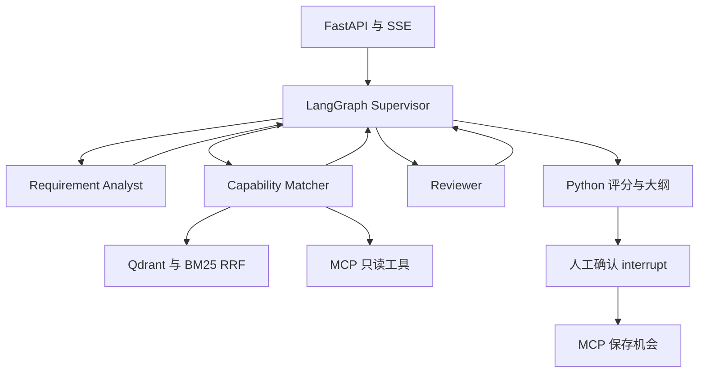

# BidPilot
**Enterprise RFP Intelligence & Bid Decision Agent**

LangGraph · Agentic RAG · Qdrant · MCP · FastAPI · PostgreSQL · Redis

上传 RFP，抽取需求、检索企业能力、验证证据、计算投标建议，再由人确认是否保存机会。AuroraSoft 及所有证书、案例、RFP 均为虚构教学数据。

## Windows Quick Start（第一套运行命令）

安装 Python **3.11 或 3.12**（含 `py` launcher）。解压后进入 `bidpilot`，在 PowerShell 执行：

```powershell
cd .\bidpilot
Set-ExecutionPolicy -Scope Process Bypass
.\scripts\setup.ps1
.\scripts\test.ps1
.\scripts\demo_lite.ps1
```

最后一条命令自动完成离线分析并询问 `Save this simulated opportunity? [y/N]`。回答 `y` 会恢复 LangGraph 并通过 MCP 保存；其他输入拒绝。报告在 `artifacts/demo/`。脚本无需激活虚拟环境；首次安装依赖需要网络，之后 Lite 分析无需联网和 API Key。

自动演示可以显式指定 `-Approve` 或 `-Reject`。不要同时指定。测试会使用临时数据库，不修改演示数据。

启动可视化演示需要两个 PowerShell 窗口：

```powershell
# 窗口 1，项目根目录
.\scripts\start_backend.ps1
# 窗口 2，同一目录
.\scripts\start_ui.ps1
```

打开 [工作台](http://127.0.0.1:8501) 或 [API 文档](http://127.0.0.1:8000/docs)。上传 `data/rfps/01-bank-data-platform.pdf` 或同名 DOCX。Lite 的 stdio MCP 由 Agent 自动启动，无需另开服务。不要用多个 backend worker 同时打开 Qdrant Local。

如企业策略禁止执行 PowerShell 脚本，可直接使用等价命令（无须改机器级执行策略）：

```powershell
py -3.12 -m venv .venv
.\.venv\Scripts\python.exe -m pip install -e ".[dev,ui]"
.\.venv\Scripts\python.exe -m bidpilot.cli demo
```

## Demo 流程与 Features

解析 PDF/DOCX/MD/TXT → Analyst 结构化抽取 → Matcher 改写查询与只读工具选择 → Qdrant + BM25 → RRF → 可选 CrossEncoder → Reviewer → 最多一次重检 → Python 评分 → 引用大纲 → 人工确认 → MCP 保存。

- 三个职责独立的 Agent，确定性 Supervisor 与条件路由；Pydantic v2 约束输出。
- 真实官方 MCP Client/Server，六个工具；stdio 和 Streamable HTTP 都有集成测试。
- 25 份知识文档、16 份 Markdown RFP，额外附 PDF/DOCX；16 份抽取标注、40 条检索、40 条匹配标注。
- Qdrant Local/Server、metadata filter、混合召回与 RRF；可选模型出错降级，并在报告中说明。
- SQLite/PostgreSQL SQLAlchemy async 持久化；Redis/MemoryCache 缓存、状态和限流。
- SSE 事件、Streamlit 需求矩阵、证据展开、缺口、应答大纲与 Approve/Reject。
- 磁盘 SQLite Checkpointer 支持进程重启后恢复；报告和证据保存快照。

## Architecture



Analyst 只读招标正文，Matcher 只接收单条需求及至多两条 query 的证据，Reviewer 只看当前需求和被引用的证据。它们通过 `BidState` 交换结构化数据。具体理由见 [架构](docs/architecture.md)。

## RAG

`RecursiveCharacterTextSplitter(500, 80)` 保留分类及来源元数据。双路各取 10 个 chunk，RRF 取 8 个，最终取 4 个（可选 rerank）。资质优先 certifications/company，技术优先 technical/products；重试时放宽分类。MATCH/PARTIAL 的引用必须属于该需求实际检索到的集合。

Lite 使用 **deterministic hash embedding**，它是字符/术语哈希基线，没有语义模型能力。Full 默认 `BAAI/bge-small-zh-v1.5` CPU 模型，也支持 API embedding。所有模型下载仅在启用对应模式时发生。[RAG 说明](docs/rag.md)

## MCP 与 Human-in-the-loop

工具：`get_company_profile`、`get_product_capability`、`get_qualification`、`get_case_study`、`get_historical_bid`、`save_bid_opportunity`。

Matcher 的 QueryPlan 选择只读工具，MCP Client 执行后把 observation 交回匹配阶段。写工具不对 Matcher 开放。人工确认通过 `POST /api/tenders/{id}/review` 恢复图；服务端签名绑定项目、评分、建议和过期时间，MCP 再验证。保存按 tender_id 幂等。HMAC 是本地演示边界，不替代企业身份认证。[MCP 文档](docs/mcp.md)

## Bid Scoring

`config/scoring.yaml`：强制覆盖 35%、资质 25%、技术 20%、案例/评分项 10%、服务/商务 10%。MATCH=1、PARTIAL=0.5、GAP=0，需求内按原文权重加权，没有该类时归一化剩余权重。强制要求既贡献强制维度，也贡献本身业务维度，这是有意强调强制条件。

每项强制 GAP 扣 20 分；≥80 BID，≥60 CONDITIONAL_BID，否则 NO_BID。强制资质 GAP 直接 NO_BID；任何强制条件未完全满足时不能 BID。潜在强制条款遗漏同样阻断推荐。所有算术在 Python 中完成，不让模型打分。

## Lite / Full

| 组件 | Lite | Full |
|---|---|---|
| LLM | FakeLLM 规则，不下载模型 | OpenAI-compatible API |
| Embedding | Hash 512 维 | BGE CPU 或 API |
| DB | SQLite | PostgreSQL |
| Cache | MemoryCache | Redis，故障回退本进程 |
| Vector | Qdrant Local | Qdrant Server |
| MCP | 自动 stdio 子进程 | Compose Streamable HTTP |
| Checkpoint | SQLite 文件 | 独立持久卷中的 SQLite 文件 |

Full 用 Docker Desktop **Linux containers**，用户无需使用 WSL/bash 命令。首次本地模型构建/下载较大，可改用 API embedding。

```powershell
Copy-Item .env.example .env
notepad .env
# 填 LLM_API_KEY、LLM_MODEL、LLM_BASE_URL
# 设置随机 APPROVAL_SECRET（backend/MCP 共用 .env）
# 默认 Full 本地 BGE；若用 API，设置 EMBEDDING_PROVIDER=api 以及模型/Key/维度
# 若 .env 原来指定 EMBEDDING_PROVIDER=hash，请改回 auto 或 api
# MODE 由 compose 覆盖成 full，不需要手改 Lite 的 MODE

docker compose up --build -d
docker compose logs -f backend
.\scripts\start_ui.ps1
```

Full backend 启动成功后打开相同 UI。停止：`docker compose down`（保留数据卷）。API embedding 可省略本地模型包：`docker compose build --build-arg INSTALL_MODELS=false` 后再 `docker compose up -d`。此时务必设置 API embedding；启用 reranker 仍需模型依赖。

宿主 Full 模式可执行 `setup.ps1 -Models`，在 `.env` 设置 MODE=full 和本机服务 URL。**Full、真实 LLM、BGE、reranker 在本交付环境中 NOT_MEASURED**；stdio、HTTP MCP 和 OpenAI-compatible 的本地协议 stub 已实测。

## Eval 与测试

```powershell
.\scripts\test.ps1
.\scripts\eval.ps1
# 已配置真实 API/Full 基础设施后才执行（会产生供应商费用）：
.\.venv\Scripts\python.exe -m eval.run --mode full
# 可选加 --rerank；评测用独立 SQLite 与临时 Qdrant collection
```

真实执行产物在 [评测报告](artifacts/eval/latest/report.md)、[summary.json](artifacts/eval/latest/summary.json)、[检索逐条 CSV](artifacts/eval/retrieval_results.csv)。默认 Lite 评测不能代表真实 LLM 能力。当前小数据集上，三种检索 Recall@4 均为 1.0；BM25 的 MRR 高于 Hybrid，不能声称 Hybrid 全面更优。详细解释和 bad case 见 [评测方法](docs/evaluation.md)。

CI 定义了 Ubuntu/Windows × Python 3.11/3.12；提供 CI 配置不代表远端已运行。本次在 Linux / Python 3.12 执行，Windows PowerShell 与 Docker 未实机验证。依赖范围见 pyproject.toml，本次版本快照在 requirements-tested.txt。

## 五个 Demo Cases

| 文件 | 观察点 |
|---|---|
| `01-bank-data-platform.pdf` | 提取页码，匹配 Kubernetes/ISO27001，确认后保存 |
| `02-ecommerce-observability.md` | Prometheus/OpenTelemetry 与电商案例引用 |
| `03-manufacturing-data.md` | ETL/SQL/数据脱敏及制造案例 |
| `05-qualification-gap.md` | ISO20000/SOC2 缺口触发重检并 NO_BID |
| `06-strict-sla.md` | 99.99%、5 年支持、30 天交付与现有能力不足 |

其他数据覆盖 API Gateway、容灾、性能、多租户和复合需求。

## 目录

```text
bidpilot/
  README.md / PROJECT_GUIDE.md / pyproject.toml
  src/bidpilot/
    agent/       graph.py / nodes.py / state.py / schemas.py / prompts/
    api/         app.py
    cache/       store.py
    documents/   parser.py
    llm/         base.py / fake.py / openai_compatible.py
    matching/    scoring.py / support.py
    mcp_client/  client.py / approval.py
    persistence/ models.py / repository.py
    rag/         chunker.py / embeddings.py / vector_store.py / bm25.py / rrf.py / reranker.py / pipeline.py
    service.py / cli.py / config.py
  mcp_server/bidpilot_mcp/server.py
  ui/app.py
  data/company_knowledge/ / rfps/ / seed/
  eval/datasets/ + 四类评测模块
  tests/unit/ / integration/ / e2e/
  scripts/       Windows 脚本与格式生成器
  config/scoring.yaml
  docs/          调研、架构、RAG、MCP、面试、简历与验收
  artifacts/eval/
  Dockerfile / docker-compose.yml / .github/workflows/ci.yml
```

## Limitations

- Lite 抽取只针对显式 bullet 条款，按章节标题分类；任意自然语言、复杂表格应使用真实 LLM 并人工复核。
- 当前是单机、单 worker 教学工程，没有认证/租户隔离；API/Compose 默认只映射回环地址。不要直接公开部署。
- Checkpointer、任务调度与 SSE 回放面向单进程。任务重启需再次 POST analyze 恢复；SSE 内存历史在重启后只回放持久报告。
- DOCX 无可靠物理页码，保留 section；扫描件 OCR/MinerU、复杂跨页表格与真实证书有效性核验属于 Future Work。
- MCP 工具读取模拟结构化 seed；上传企业文档只更新 RAG，不自动改 seed。证书核验仍应看原始法律材料。
- FakeLLM 不理解全部否定范围、条件限制或时态；正文数字比较只覆盖演示单位。即使 citation ID 有效也可能错误蕴含。
- 真模型输出需供应商支持 function calling；超时/无效 schema 最多两次，失败保守降级或明确报错。
- Full Compose、Redis/PostgreSQL 实例、BGE/reranker 和真实 API 需要用户环境验证；环境不具备时绝不填虚构指标。

