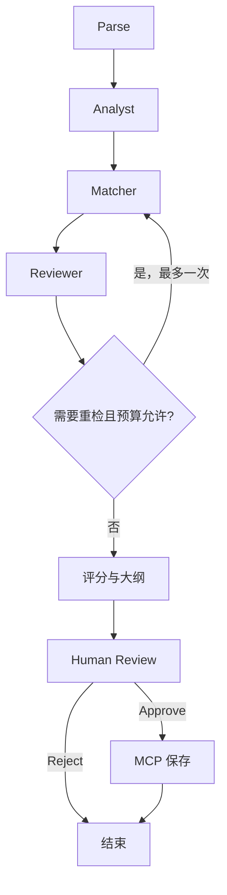

# LangGraph 工作流

真实入口为 `src/bidpilot/agent/graph.py:build_graph`：创建 `StateGraph(BidState)`、注册节点、添加条件边并编译。每个业务节点返回下一阶段 phase，再由 supervisor 条件路由。Supervisor 是调度节点，不是第四个主要 Agent。

这里显示业务顺序；实际节点之间经 Supervisor 返回，完整代码比图多这些调度边。

- State：同一 tender 的显式数据容器，保存 requirements、matches、evidence、retry_count 等。
- Node：一个可独立理解的处理步骤，例如 analyst 或 score；通常 async 返回局部状态。
- Conditional Edge：根据 phase 选择下一个节点。Reviewer 失败时重新进入 matcher。
- Checkpoint：`AsyncSqliteSaver` 在每个图步骤后记录状态。不是最终报告数据库的替代物。
- Short-Term Memory：checkpoint 中保留当前 tender/消息摘要；独立问答只保留最近四轮，防止上下文不断膨胀。
- Human-in-the-loop：`interrupt(payload)` 先返回待确认信息；同一 thread_id 用 `Command(resume={"approve":True})` 恢复。

中断节点在恢复时会重新从节点开始执行，所以 interrupt 之前没有业务写入。写机会放在独立 save 节点，且以 tender_id 幂等。重复调用 review 被拒绝，签名 token 绑定待确认的固定字段。

默认 `MAX_GRAPH_STEPS=30`，Supervisor 还设迭代上限；`MAX_RETRIEVAL_RETRY=1`；每次 run 的工具总数上限 10，给最后一次写预留一个名额。LLM 每次请求超时 45 秒、两次尝试。代码不暴露或保存私有链式思考，只记录可审查的计划、工具输入输出与结构化结果。

SSE 由 `graph.astream(..., stream_mode=["updates","custom"])` 驱动，节点用 get_stream_writer 发送 retrieval/progress/review。聊天 SSE 在完整答案校验后按块输出，因此它是经过校验的展示流，不是模型原生逐 token 流。

实测重启恢复见 `tests/integration/test_workflow.py`。Windows 不应使用 selector loop 强制覆盖默认事件循环；stdio 子进程由 MCP SDK 管理。API 的本地启动脚本不启用 reload、多 worker。
